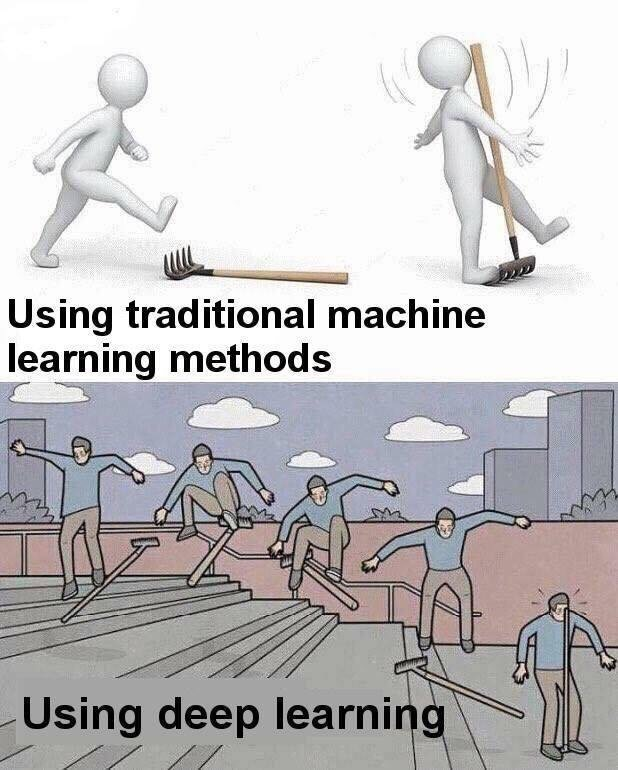

# A collection of machine learning experiments

## Algorithms explored

1. Classification
2. Clustering
3. Recommendation
4. Regression

## Requirements

1. Python 3.6
2. sklearn, numpy and pandas

## Installation

1. virtualenv -p python3.6 venv
2. . venv/bin/activate
3. pip install -r requirements.txt

## To run

1. cd into a directory
2. ./main.py

## Important info

